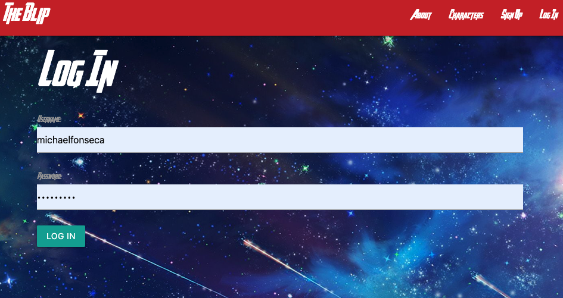
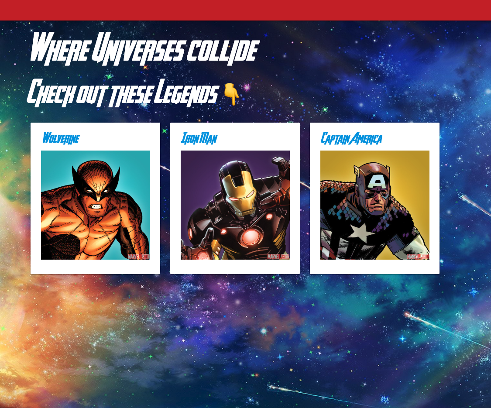
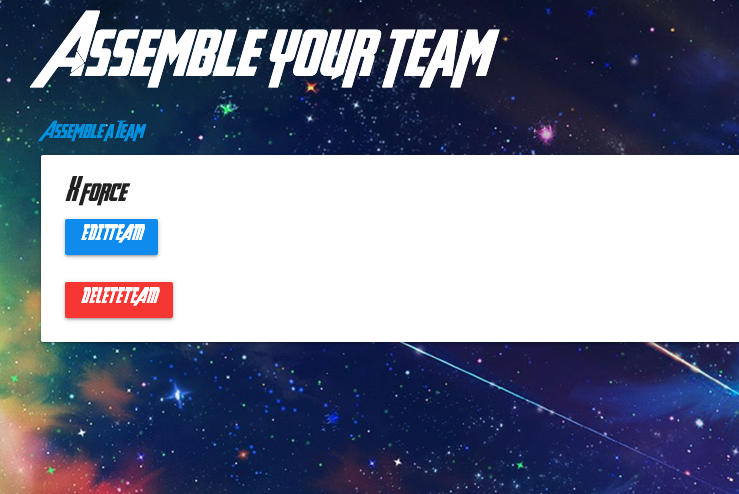
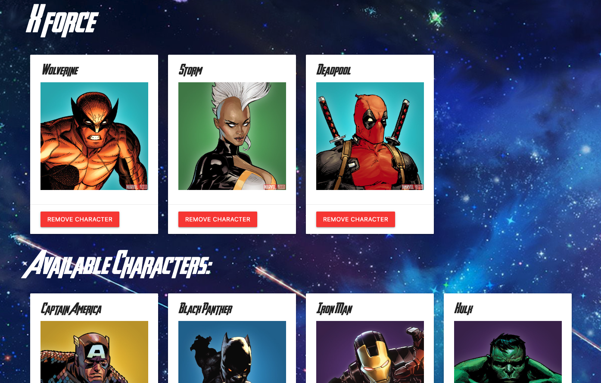

#The BLIP

# Description: 

The Blip is a website that allows you to search thru the multiverse of heroes with the Marvel and SuperHero API. This application lets you see a collection of comics and heroes from different events and stories. Along with the SuperHero API the user can see more information from their characters such as biography, other alias, and even character stats. A key feature of this application is any user can assemble their very own team of heroes or villains. 

## Project proposal:
[Trello](https://trello.com/b/QgbdeUtP/project-management)

## Website previews:

## 👇 Check out the website here! 👇

[See the app working!]()

# Technologies:
- JavaScript
- HTML
- CSS
- Django
- Git
- Visual Studio Code
- API
- Python

# Icebox Feature: (soon to come)
- A poll that grants users the ability to vote on their favorite character
- A like feature, favorite list, and share feature.